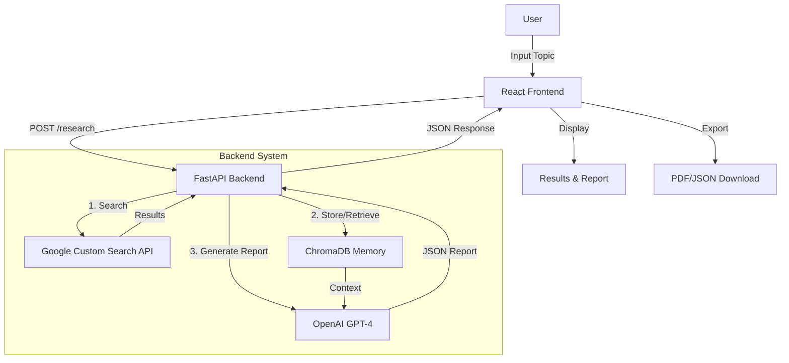

```mermaid
graph TD
    User[User] -->|Input Topic| Frontend[React Frontend]
    Frontend -->|POST /research| Backend[FastAPI Backend]
    
    subgraph Backend System
        Backend -->|1. Search| Google[Google Custom Search API]
        Google -->|Results| Backend
        
        Backend -->|2. Store/Retrieve| Chroma[ChromaDB Memory]
        
        Backend -->|3. Generate Report| LLM[OpenAI GPT-4]
        Chroma -->|Context| LLM
        LLM -->|JSON Report| Backend
    end
    
    Backend -->|JSON Response| Frontend
    Frontend -->|Display| UI[Results & Report]
    Frontend -->|Export| PDF[PDF/JSON Download]
```
